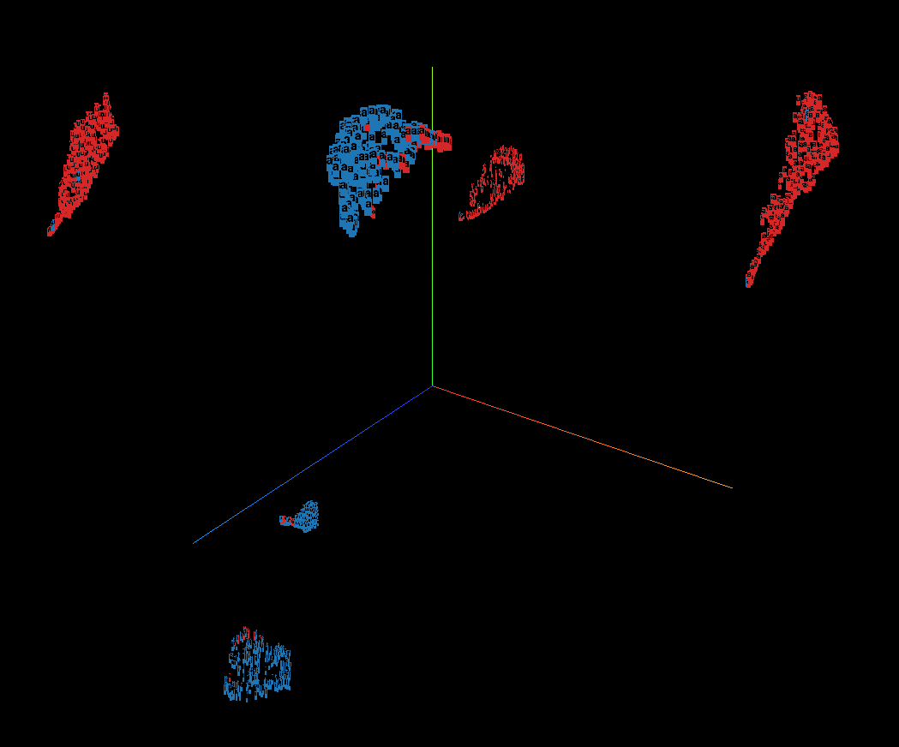

<<<<<<< HEAD
# Voxplorer
Voxplorer is a dashboard to explore your speech data.  
The main features are:
- Feature extraction of files or pre-processed data table upload.
- Interactive table visualisation, filtering, and sorting.
- Dimensionality reduction.
- Interactive 2D or 3D visualisations with support for color and shape labelling.
=======
# voxplorer (Alpha v1.0.0)
  
>>>>>>> 5d6473e (Update to README)

## Data input
There are two options to get your data on the dashboard:
1. [Uploading directly a data table.](#uploading-a-data-table)
2. [Uploading a set of audio files and extract features from within the dashboard.](#uploading-audio-files)

### Uploading a data table

### Uploading audio files
