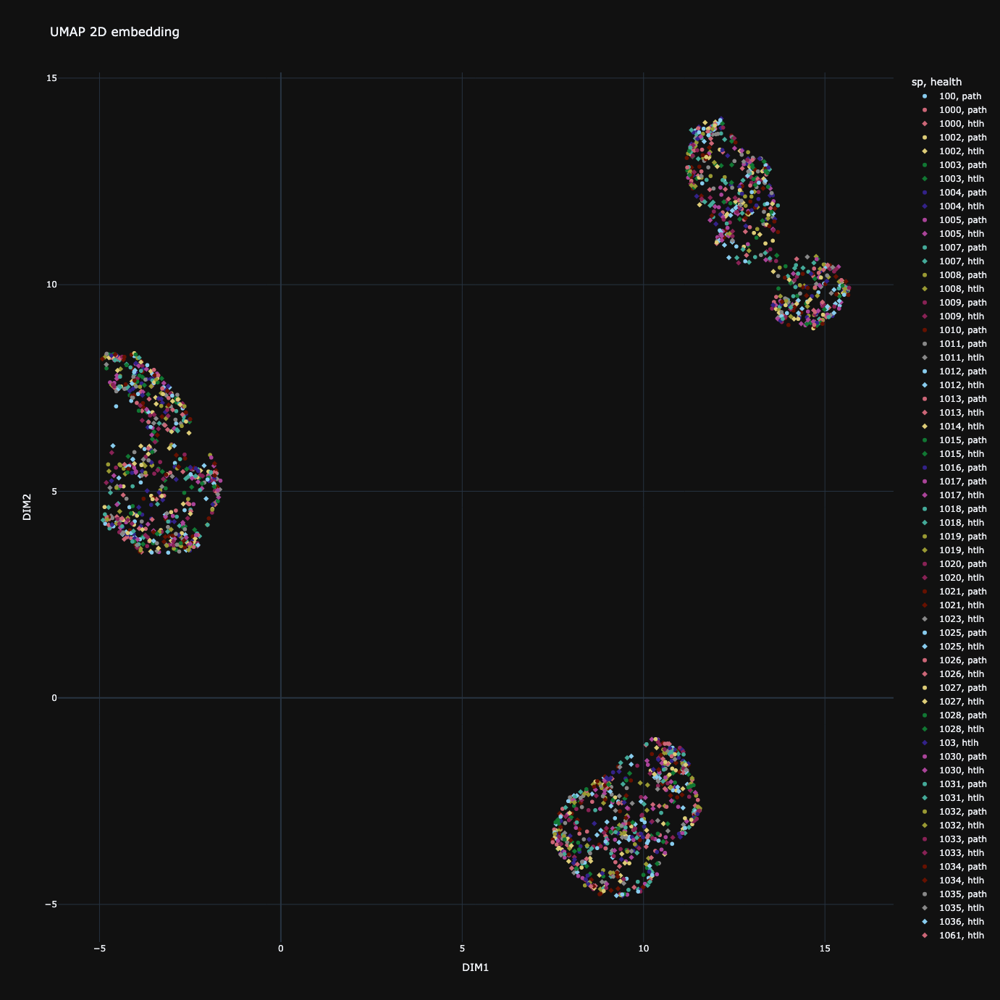
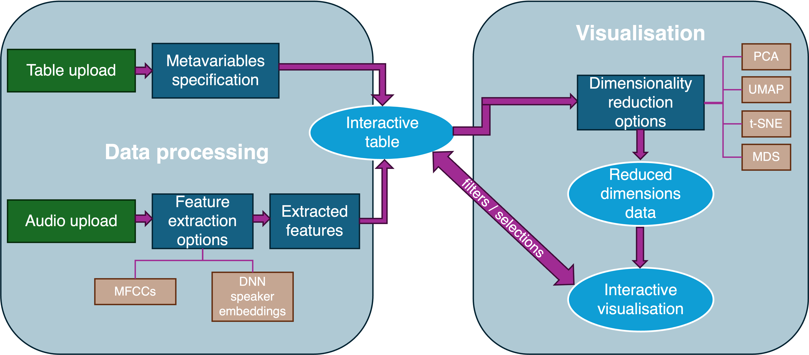

# Voxplorer
Voxplorer is a web-app dashboard tailored to the analysis of voices.  
Voxplorer allows users to upload their pre–computed data in the form of 
a `CSV`, `TSV`, or `XLSX` table, or alternatively upload audio files (`WAV`, `MP3`, or `FLAC`) 
and extract either MFCCs or speaker embeddings (thanks to pre–trained 
[speechbrain](https://huggingface.co/speechbrain) models). 
  
The daashboard supports several dimensionality reduction algorithms to allow 
users to visualise in 2 or 3 dimensions their data in an interactive plot.  
This is paired with an interactive table of the full feature set, which allows 
users to filter data by values or logic statements, isolating particular data points 
in the visualisation. 
  
Finally, voxplorer supports the download of the full dataset or only the selected 
observations (both full feature set and reduced space when available). 
In parallel a `JSON` log of each processing setting (dimensionality reduction and 
feature extraction when used) will be downloaded, allowing the users to reproduce 
their visualisations and reduced dimension space. 
The figure also supports download as a `PNG` image.  
  


# Installation
## Cloning the repository
First, move into the desired directory in which you would like 
to store voxplorer.  
Clone this repository:
```sh
git clone https://github.com/liri-uzh/voxplorer.git
```

If you would like to stay up to date with the most recent updates before an 
official release, clone the "develop" branch.
```sh
git clone --branch develop https://github.com/liri-uzh/voxplorer.git
```

## Install the dependencies using uv (recommended)
If you are using [`uv`](https://docs.astral.sh/uv/) as a package manager you don't need to do manually install the 
dependencies in a virtual environment; you can run the app by simply running the 
following `uv` command from the `voxplorer` directory.
```sh
cp voxplorer
uv run app.py
```

## Installing dependencies using pip
```sh
cp voxplorer
pip install -r requirements.txt
```

# Running voxplorer
To run `voxplorer`, you can move the local repository and run
```sh
uv run app.py
```
or
```sh
python3 app.py
```
In the output you will see where the address at which the app is running locally; 
copy it in your chosen browser address. 
*Normally the app will run at 127.0.0.1:8050*
<!--TODO: ## Creating an alias for voxplorer -->
# Workflow
The general workflow is described in the following diagram; 


# Output
`Voxplorer` has 3 types of outputs:
1. tables (`CSV`)
2. figures (`PNG`)
3. logs (`JSON`)  
Tables are always the full features table (either uploaded or computed within the 
dashboard) and the reduced dimensions table (if dimensionlity reduction was ran). 
These can be either all observations or only selected observations (two different 
download buttons).  
Logs contain all the settings used to process the data for either or both 
dimensionality reduction and feature extraction. Logs are downloaded automatically 
when downloading tables.  
Figures can be downloaded using the `camera` button in the interactive figure and 
are basically a screenshot of the figure as seen currently. 

# API
[./lib](./lib/) contains the 4 main backend components of `voxplorer`:
1. the [data loader](./lib/data_loader.py)
2. the [feature extractor](./lib/feature_extraction.py)
3. the [dimensionality reduction](./lib/dimensionality_reduction.py)
4. the [plotter](./lib/plotting.py)  
Each function and class in these files is well documented within their docstring, 
but more in-detail documentation should be coming soon.

# Upcoming features
- [ ] voxplorer on pypi
- [ ] recogniser
